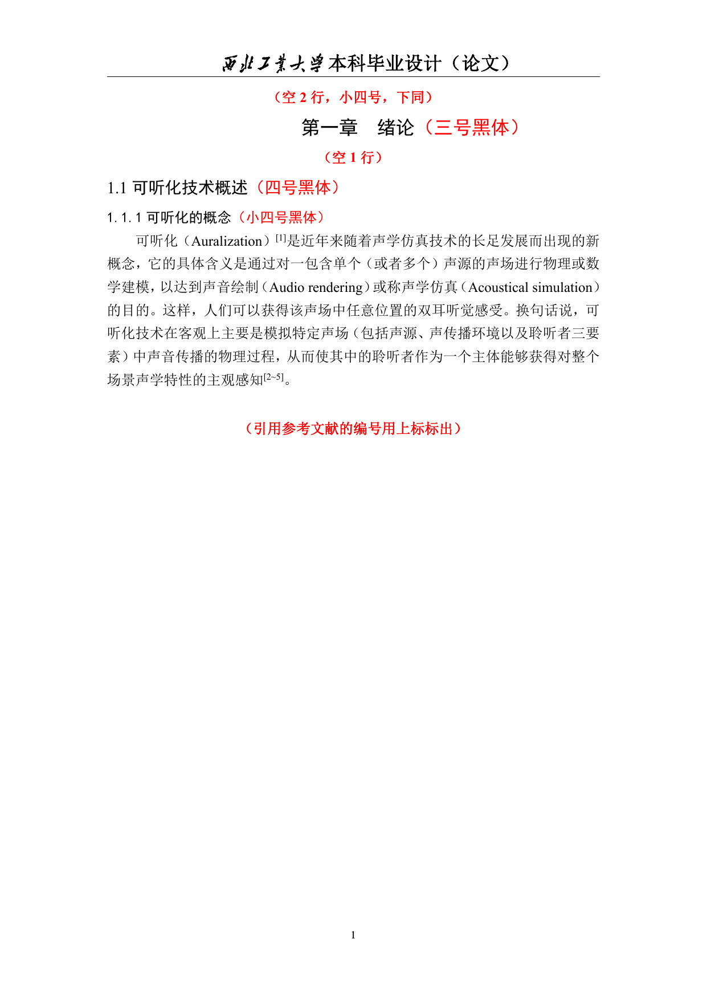
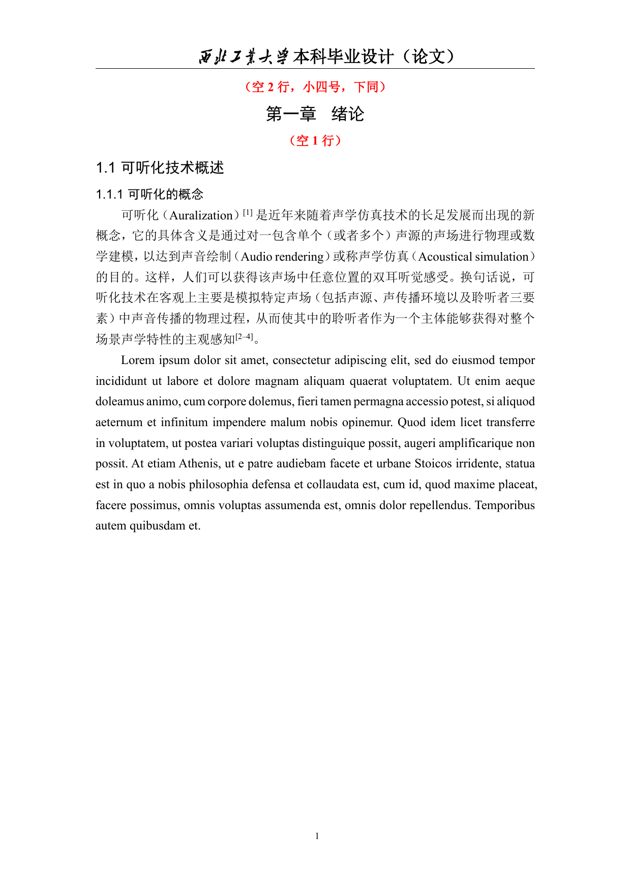

# nwpu-thesis-undrergraduate


根据nwpu本科毕业设计docx模板设计的typst模板.
模板主体为 `style.typ`.
本模板旨在实现与标准docx模板的像素级一致.

# usage

```rust
#import "style.typ": thesis
#show: thesis.before_main
// 中英文摘要
#show: thesis.catalog // 自动生成目录
#show thesis.main_body
// 正文
#show: thesis.tail
// 开始不记章节的内容
#(thesis.bib)("test_sty.bib") // 生成参考文献
// 致谢, 附录等
```

# validation & visual comparison

docx 模板与 typst 输出的绪论页对比 (docx_template.pdf 第16页 vs test_sty.pdf 第4页):

<div align="center">




</div>

用于测试和验证的文件:
- `test_sty.typ`: 生成绪论页以及完整的论文框架测试
- `inspect_xxx.py`: 使用`pdfplumber`快速验证typst模板的正确性
- `test/`: docx行间距逻辑分析, ai生成的测试以及杂项

已经实现绪论页主要内容误差小于`1pt`. 将继续修正其他部分.

> 众所周知typology是一项恶心的缺乏文档的学问, 对本项目探索的具体细节可以参考[style.typ](./style.typ)和[spacing_patter.md](./test/spacing_patter.md)中的解释; 对于无法通过理论填补的误差使用[corrections.typ](./corrections.typ)校正.

> 标准docx模板存在瑕疵, 如宋体数字(在公式标号),times和黑体混用, 目录下划线和填充异常, 不采用三线表等, 本模板将选择忽略.

# coverage

- 字体
  - [x] 正文小四宋体+Times New Roman x1.25 行距, 一级标题三号黑体 x1.25, 二级标题四号黑体 x1.25, 三级标题小四黑体 x1.25
  - [x] 公式`New Computer Modern Math`字体, 间距
  - [x] 表格五号宋体 x1.5 行距
- 段落
  - [ ] justify
  - [ ] 默认缩进
- 页面
  - [x] 页眉3.18cm,距离顶部1.5cm,logo+文字+横线
  - [x] 页脚3.18cm,距离底部1.75cm, 页数小五Times New Roman左对齐缩进23字符
- 标题
  - [x] 标题/图/表计数,包含在目录
- 块
  - [x] 正文和标题的块,公式块可分割
  - [ ] 增加公式padding
- 目录
  - [x] 正文字体, 一级标题加粗, 缩进 (1.7em?)
- 公式
  - [x] 公式编号, 对齐
- 图表
  - [x] 图表编号
  - [x] 图题宋体五号,位置
  - [x] 表题黑体五号,位置
  - [x] x1.5行距
  - [ ] 图表引用格式
- 摘要,正文,参考文献
  - [x] 正文前后的编号
  - [x] 参考文献与引用格式
  - [x] 参考文献 x1 行距
# todos
- 行距,字体设置/检查 (50%)
- 引用标记高度
- 包装一级标题前后行
- 包装图表前后行

# license
[Unlicense: freely and unencumberedly released to public domain](./LICENSE).